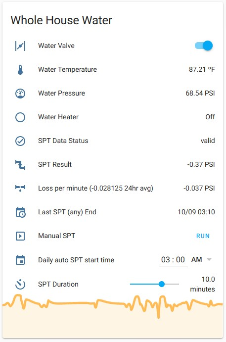
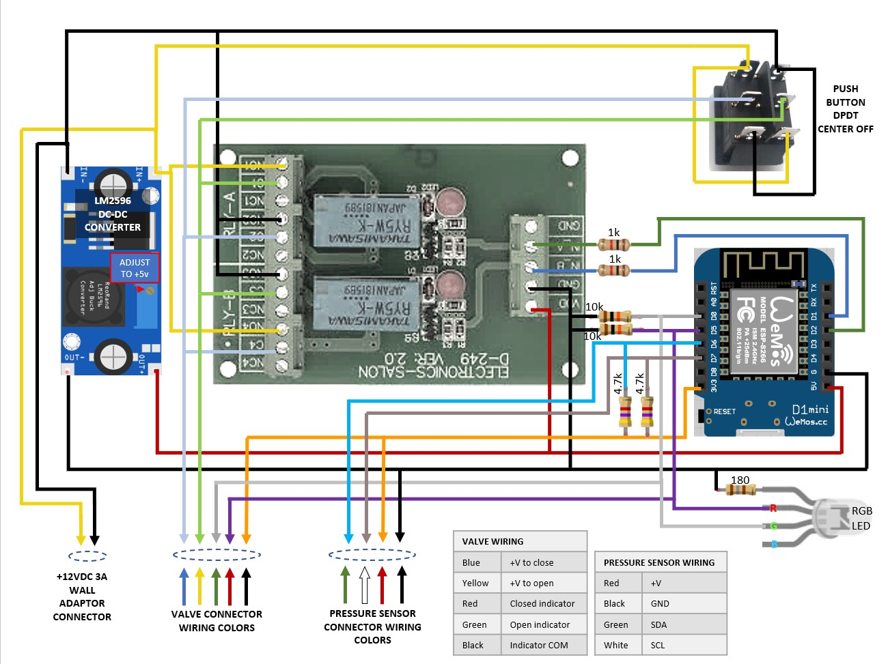

# **Whole House Water Leak Detection & Valve Control**
The project described here is a part of a complete water detection system consisting of the following major components:
- Water Valve to cut off water flow should a leak be detected
- Pressure Sensor to detect small or slow leaks using a periodic static pressure test (weeping valves, toilet internals, etc.)
- Supervisory computer to schedule tests, analyze results, respond to leaks, and provide a UI.  I use Home Assistant, but a similar MQTT capable system should suffice.
- Remote water leak sensors placed under sinks and other areas of likely leakage to trigger immediate water cutoff for sudden leaks

The project detailed here satisfies the first two components in the list above.  A robust MQTT command set is incorporated for interfacing to a supervisory computer.

The code provided does not require the pressure sensor or the valve to be installed to be useful.  It is possible to use the system as a valve control box only or a pressure sensor only.
<br/><br/>
## **Pressure sensor**
If you need only valve control, the pressure sensor does not have to be installed. Just be sure to set the software accordingly either by setting the *#define INITIAL_PRESSURE_SENSOR_INSTALLED_STATE* directive in the code or during runtime using the *pressureInstalled* MQTT command.

The pressure sensor used is a M3200 series I2C interfaced model from TE Connectivity Industrial Pressure Sensors.  The specific model I used is M32JM-000105-100PG purchased from Mouser Electronics.  If you use this model be aware that external 4.7K pull up resistors are required for the SDA and SCL wires.

### **Pressure Sensor Default Programming**
Programming behavior can be changed by varying the *#define* directives in the program.  Here is the default behavior:
- Sensor is read every 500ms
- Under quiescent conditions, pressure is published every 5 minutes
- If there is a pressure change of more than 0.3 PSI, the current pressure is published every five seconds
- If the pressure sensor cannot be read a fault will be published every 5 minutes
<br/><br/>
## **Motorized Valve**
If you need only pressure sensing, the valve does not have to be installed.  Just be sure to set the software accordingly either by setting the *#define INITIAL_VALVE_INSTALLED_STATE* directive in the code or during runtime using the *valveInstalled* MQTT command.

The motorized valve used is a U.S. Solid model JFMSV00014 3/4" diameter Motorized Ball Valve (available on Amazon).  _Be sure you order the diameter approriate for your plumbing_.  

This model has five wires - two to control the valve (via polarity reversal) and three to connected to open/closed indicator switches.  There are other models from U.S. Solid that look the same but have different wire configurations.  The five-wire model is required if you wish to use this code without modification.

The five-wire model enables detection of the valve state.  Since there is a manual switch for opening/closing the valve, there is a possibilty that the last stored state of the valve in software is out of sync with the actual valve position.  The software compensates for this by sychronizing with the actual state of the valve.
<br/><br/>
## **Software**
The Water Main Controller software is written using PlatformIO.  However, it can be compiled using Arduino IDE by simply copying the text in src/main.cpp to a Arduino sketch file (e.g watermain.ino) and compiling using the IDE.  You will need to add the libraries indicated in the code comments before compiling.

### **MQTT**
All reporting and interaction with The Water Main Montior is accomplished via MQTT.  If you've never heard of MQTT, there are many good tutorials on the web,  It is best to have a firm grasp on MQTT concepts before beginning this project.

Although there is robust logging available from the serial port, the primary interface for interaction and configuration is through MQTT reports and commands.  The documentation for commands are in the code and are purposely not duplicated here to avoid having to maintain documentation in multiple places.

Using a MQTT tool such as MQTT Explorer (http://mqtt-explorer.com/) is strongly recommended to fully understand, configure, test, and debug the project.

### **Static Pressure Test**
Both the pressure sensor and the valve must be installed to use this feature.  

A Static Pressure Test is used to check for small leaks by turning off the water coming into the house for a short time and watching for a pressure drop when water is not being used and the hot water heater is not heating.  Determining hot water heater activity requires an additional sensor that is outside the scope of this project.  Short of sensing hot water heater activity, simply pick a time for the test when the hot water heater activity is unlikely.

The amount of pressure drop indicating a leak will vary with the plumbing system.  You will need to establish what pressure drop is normal for your properly sealed plumbing system in order to determine the setting for your leak alarm threshold.

A Static Pressure Test is initiated by sending the *sptStartTest* MQTT command (read code comments for all commands) to the controller.  Once the command is received, the test begins immediately.  

Results are published via MQTT at the end of the test.  It is up to program logic in the supervisory computer to determine if the test passed, failed, or is invalid due to water use or hot water heater activity.  In my case the program logic is accomplished using Home Assistant.
- Default SPT duration is 10 minutes
- Pressure reporting frequency is set to every 30 seconds during SPT.  Reporting frequency is restored to pre-test frequency when the test concludes.
- Valve is closed at the start and restored to pre-test state at end of test
- Timestamp of start of test, test duration, beginning pressure, ending pressure, and the difference is published via MQTT at the *end* of the test
- If a sudden/large pressure drop occurs during the SPT, the test a aborted, the valve is opened, and an aborted SPT status is published .  This avoids the inconvenience of water not being availble for the duration of the SPT test.  The supervisory computer can reschedule a test should this occur.


### **Home Assistant**
If you use Home Assistant, the following are the MQTT definitions required for your configuration.yaml.  You will need to study the MQTT commands and topics in the code to write your own data display, leak actions & alarms, etc.

Obviously, if you did not install both pressure sensor and valve, the Static Pressure Test and some parts of the MQTT configuration will not apply.

```
 mqtt:
    sensor:
      - unique_id: water_spt_data_status
        name: "SPT Data Status"
        state_topic: "watermain/spt_data_status"
        json_attributes_topic: "watermain/data_status/attributes"
        qos: 0

      - unique_id: water_pressure
        name: "Water Pressure"
        state_topic: "watermain/water_pressure"
        qos: 0
        device_class: "pressure"
        unit_of_measurement: "psi"
        expire_after: 600 # state becomes "unknown" after 10 minutes

      - unique_id: water_temperature
        name: "Water Temperature"
        state_topic: "watermain/water_temperature"
        qos: 0
        device_class: "temperature"
        unit_of_measurement: "°F"
        expire_after: 600 # state becomes "unknown" after 10 minutes

      - unique_id: unvalidated_water_static_pressure_test_result # see sensor.validated_water_static_pressure_test_result
        name: "Unvalidated Water Static Pressure Test Result"
        state_topic: "watermain/spt_result"
        unit_of_measurement: "psi"
        json_attributes_topic: "watermain/spt_result/attributes"

    switch:
      - name: "Water Valve"
        unique_id: water_valve
        state_topic: "watermain/valve_zeroisclosed"
        command_topic: "watermain/cmd/valveState"
        payload_on: "1"
        payload_off: "0"
        qos: 2
```
<br/>
The following are the template sensors derived from the the controller data.
<br/>

```
sensor:
    - platform: template
      sensors:
        last_static_pressure_test:
          friendly_name: "Last Static Pressure Test"
          value_template: >-
            {{ as_timestamp( state_attr('sensor.unvalidated_water_static_pressure_test_result', 'test_end'), '' ) 
            | timestamp_custom ('%m/%d %H:%M', True, 'unknown') }}

    - platform: template
      sensors:
        validated_water_static_pressure_test_result:
          friendly_name: "Validated Water Static Pressure Test Result"
          unit_of_measurement: "psi"
          value_template: >-
            
              {{ states('sensor.unvalidated_water_static_pressure_test_result') }}
            

    - platform: template
      sensors:
        water_static_pressure_loss_per_minute:
          friendly_name: "Pressure Loss per Minute"
          unit_of_measurement: "psi"
          value_template: >
            {{ (states('sensor.validated_water_static_pressure_test_result') | float(default=0)) / 
              (states('input_number.inp_num_spt_duration') | float(default=0)) }}

    - platform: template
      sensors:
        min_water_pressure:
          friendly_name: "Min Water Pressure"
          unit_of_measurement: "psi"
          value_template: "{{ state_attr('sensor.24hr_avg_water_pressure', 'min_value') }}"

    - platform: template
      sensors:
        max_water_pressure:
          friendly_name: "Max Water Pressure"
          unit_of_measurement: "psi"
          value_template: "{{ state_attr('sensor.24hr_avg_water_pressure', 'max_value') }}"      
```
<br/>
To manually start the SPT test, use the following script.
<br/>

```
script:
  scr_manual_spt:
    sequence:
    - service: mqtt.publish
        data:
        topic: watermain/cmd/sptStart
```
For a more comprehensive example or more details, my complete Home Assistant code is available at https://github.com/yang3535/HomeAssistantConfigUnderHassOS.  Look in the following files and search for "spt" to see how I implemented various functions.
- automations/automations.yaml
- sensors.yaml
- scripts.yaml

<br/><br/>
Below is my Home Assistant dashboard for configuring & monitoring the system.  Note the water heater sensor shown in the dashboard is not part of this project.  Since the water heater being active influences the SPT results, I postpone the SPT test in my automation if the water heater is active.  If you run the Static Pressure Test in the middle of the night, water heater interference is less likely, so water heater sensor is optional.



<br/><br/>
## **Electronics**
The list of components I used is below.  It looks like a long list because of the URLs, but here are only eight main items.  If you plan to 3D print the enclosure, buying the specific electronic parts below will ensure fit inside the enclosure.

- Qty 1 - M32JM-000105-100PG - 
TE Connectivity Industrial Pressure Sensors
US HTS:8532290040 ECCN:EAR99 COO:CN (Mouser Electronics part # 824-M32JM-000105-100) https://www.mouser.com/ProductDetail/Measurement-Specialties/M32JM-000105-100PG/?qs=%2Fha2pyFaduiKS8vuISRZt1c2xbCd05SXKUGrxnTvYozgz5HdA8ryOL3gmNri9Gka
- Qty 1 (optional)  - Motorized Ball Valve model JFMSV00014- .75" Stainless Steel Electrical Ball Valve with Full Port, 9-24V DC and 5 Wire Setup, can be used with Indicator Lights, [Indicate Open or Closed Position] by U.S. Solid
https://amazon.com/dp/B06Y11B8VN/ref=cm_sw_em_r_mt_dp_zI.YFbWGFTD1B?_encoding=UTF8&th=1
- Qty 1 - WeMos ESP8266 D1 Mini https://www.amazon.com/Makerfocus-NodeMcu-Development-ESP8266-Compatible/dp/B01N3P763C/ref=sr_1_26?dchild=1&keywords=Wemos+esp8266&qid=1609860600&sr=8-26
- Qty 1 - mxuteuk 3pcs/pkg (only one is needed) Momentary Rocker Switch Toggle Power Button (ON)/Off/(ON) 6 Pin 250V/10A 125V/15A, Use for Car Auto Boat Household Appliances KCD2-223-JT  by mxuteuk https://amazon.com/dp/B0885W19KL/ref=cm_sw_em_r_mt_dp_.A.YFbV7YQZZY?_encoding=UTF8&psc=1
- Qty 1 - Electronics-Salon 2 DPDT Signal Relay Module Board, DC 5V Version, for Arduino Raspberry-Pi 8051 PIC.  by Electronics-Salon.  https://www.amazon.com/Electronics-Salon-Signal-Version-Arduino-Raspberry-Pi/dp/B00SKG6OM4/ref=sr_1_11?dchild=1&keywords=Electronics+Salon&qid=1609815721&sr=8-11
- Qty 1 - RGB LED https://www.amazon.com/Diffused-Multicolor-Common-Cathode-Arduino/dp/B01FDD3B72/ref=sr_1_39?crid=2UPMVM1W8WIF2&dchild=1&keywords=single+rgb+led&qid=1609817012&sprefix=single+RGB+led%2Caps%2C176&sr=8-39
- Qty 1 - LM2596 Buck Converter https://www.amazon.com/DZS-Elec-Adjustable-Electronic-Stabilizer/dp/B06XRN7NFQ/ref=sr_1_12_sspa?dchild=1&keywords=buck+converter+arduino+2596&qid=1609860095&sr=8-12-spons&psc=1&spLa=ZW5jcnlwdGVkUXVhbGlmaWVyPUEzUVM4MExIWE5HQkM5JmVuY3J5cHRlZElkPUEwMjc5Mjg0RlZYOFpLUlk3VEJUJmVuY3J5cHRlZEFkSWQ9QTA2Nzk2NzAxMkoxS1lZWUdYRzlHJndpZGdldE5hbWU9c3BfbXRmJmFjdGlvbj1jbGlja1JlZGlyZWN0JmRvTm90TG9nQ2xpY2s9dHJ1ZQ==
- Qty 1 - 12VDC Power supply 
https://amazon.com/gp/product/B07HNV6SBJ/ref=ppx_yo_dt_b_asin_title_o01_s00?ie=UTF8&psc=1

The panel mount holes of the 3D printed enclosure accomodates the specific connectors listed below.  If you don't want to use these connectors, the 3D Fusion360 source file can be modified to suit whatever connectors you choose.

Note the aviation connectors below are specified with different number of pins to prevent accidentally interchanging the pressure sensor and the valve control wires.  It is possible to use the 6-pin version for both wires if you don't confuse the two or select pin connections so no harm is done if interchanged.  

- Qty 1 - Female DC Power Jack Panel Mount 5.5mm x 2.1mm https://www.amazon.com/TOTOT-5-5mm-Female-Socket-Electrical/dp/B077YB75N3/ref=sr_1_10?dchild=1&keywords=power+jack+5.5mm&qid=1609815794&sr=8-10
- Qty 1 - 4-pin Aviation Connector set https://amazon.com/gp/product/B07GZFQDNS/ref=ppx_yo_dt_b_search_asin_title?ie=UTF8&psc=1
- Qty 1 - 6-pin Aviation Connector set https://smile.amazon.com/gp/product/B07L1Q69R5/ref=ppx_yo_dt_b_search_asin_title?ie=UTF8&psc=1
<br/><br/>
### Wiring & Assembly

Wiring Diagram - The Wemos D1 Mini ESP8266 device is shown right side up in the diagram below for clarity, but will actually be mounted upside down in the 3D printed enclosure.


<br/><br/> 

Components mounted in 3D printed case - Note the color of wires do not match those of the above diagram.  The indicator LED is mounted above the manual valve control on the right side.  The leftmost aviation connector is  currently unused.


<br/><br/> 

Installed project - Leftmost avaition connector is currently unused.  The blue cylinders are a whole-house water filter which conveniently had a 1/4" NPT fitting suitable for the pressure sensor.


<br/><br/>
## **3D Printed Enclosure**
3D Printing files and the Fusion360 source file are available in this repository under the 3D_Printed_Enclosure directory.  I printed my enclosure using PETG to avoid potential shrinkage issues surrounding the snap-on lid, but there is nothing special about PETG otherwise.  Both STL and Fusion360 files are provided.  If you don't have a 3D printer, there are many services available online that will print for a fee.

You will need to print the bottom, the lid, and one of the two slide-in mounts depending on desired final orientation.

- The wiring diagram above shows the WeMos ESP8266 D1 Mini ESP8266 board right side up for clarity, but it is mounted upside-down in the enclosure for assembly.  Be aware of this before you start wiring.


